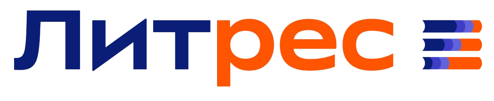
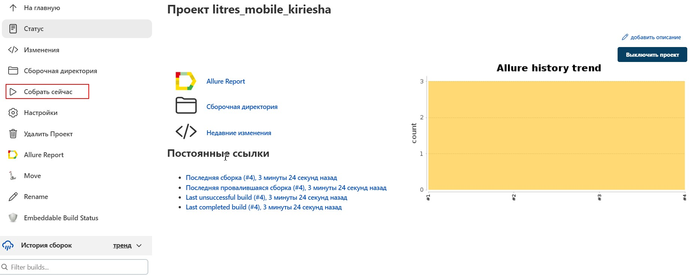
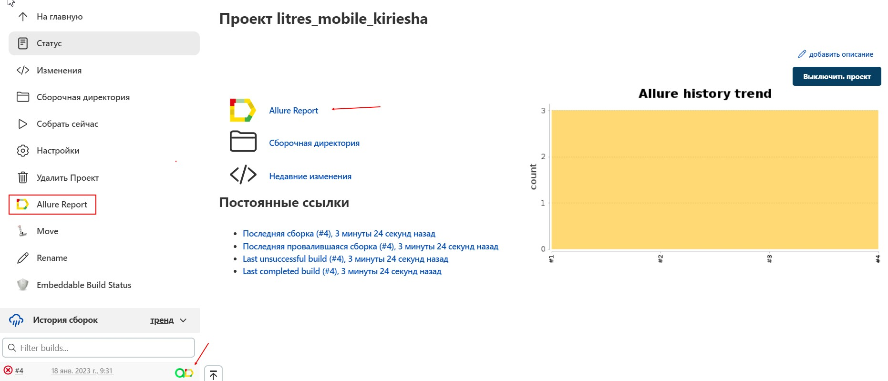
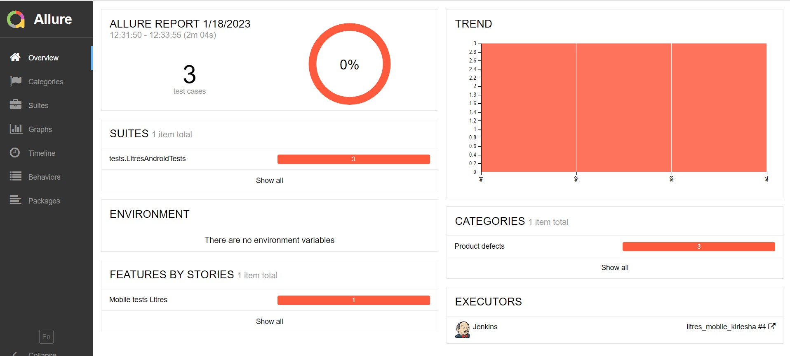
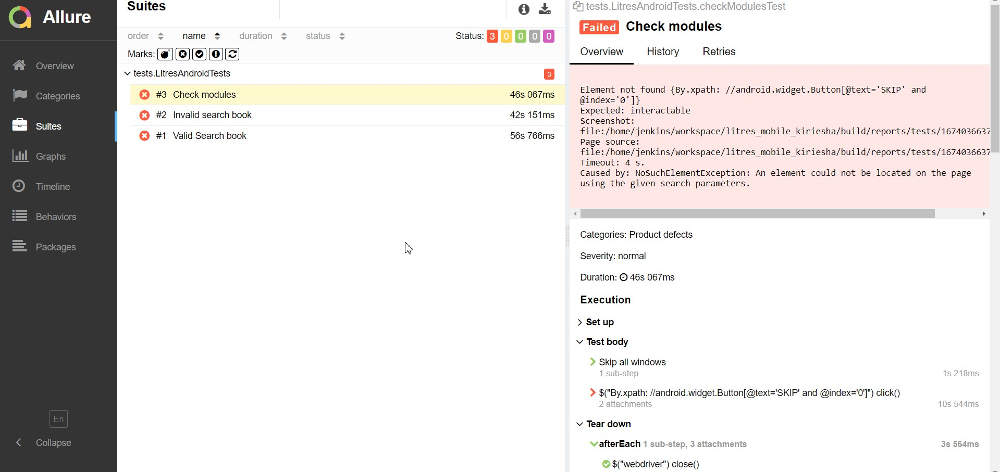
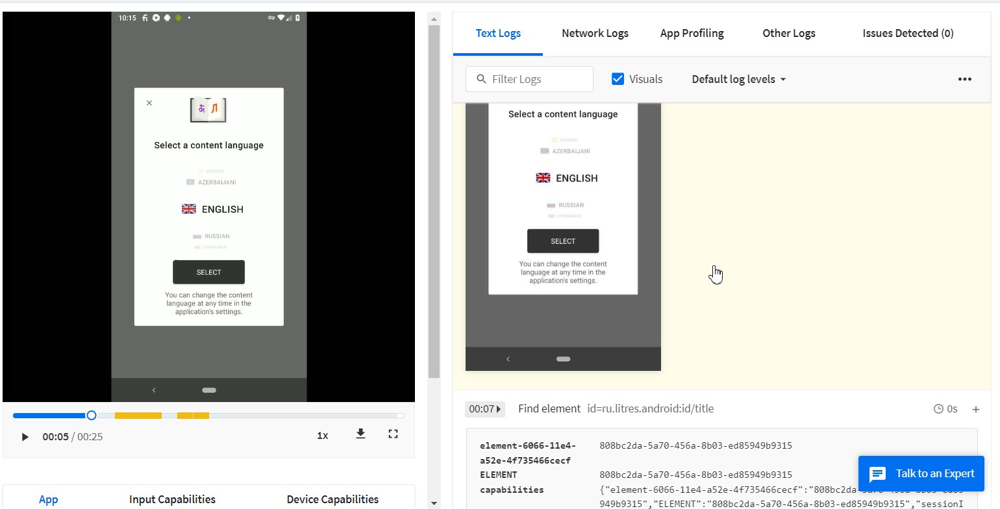
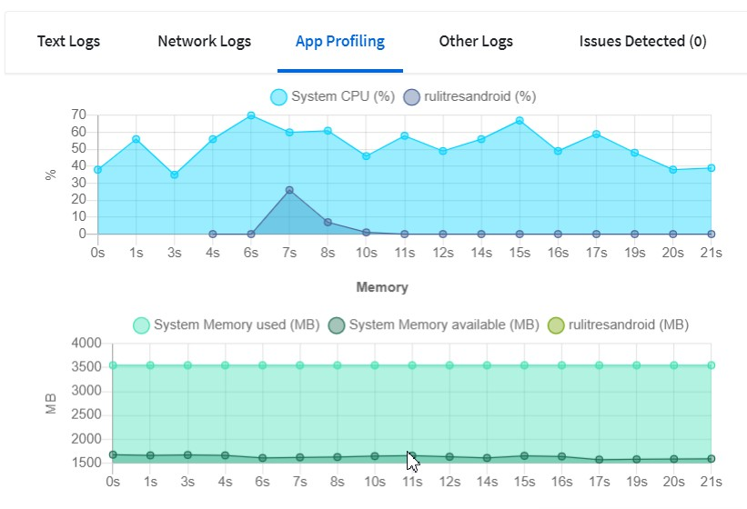
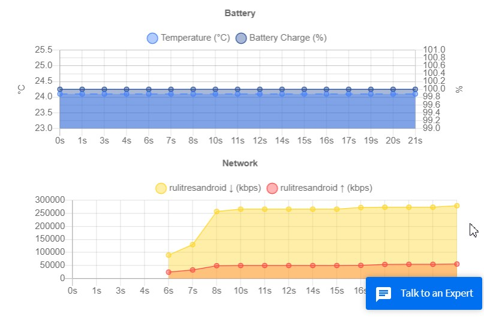
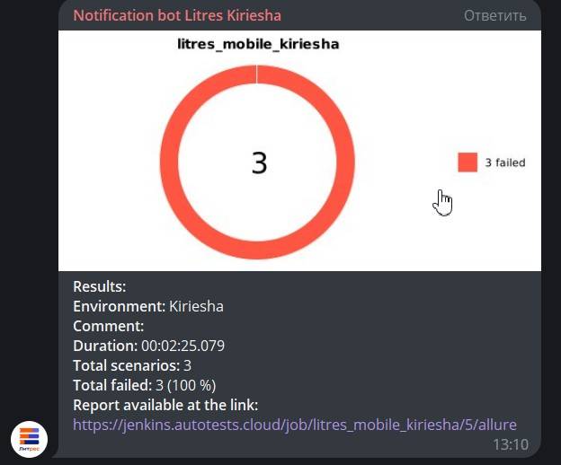
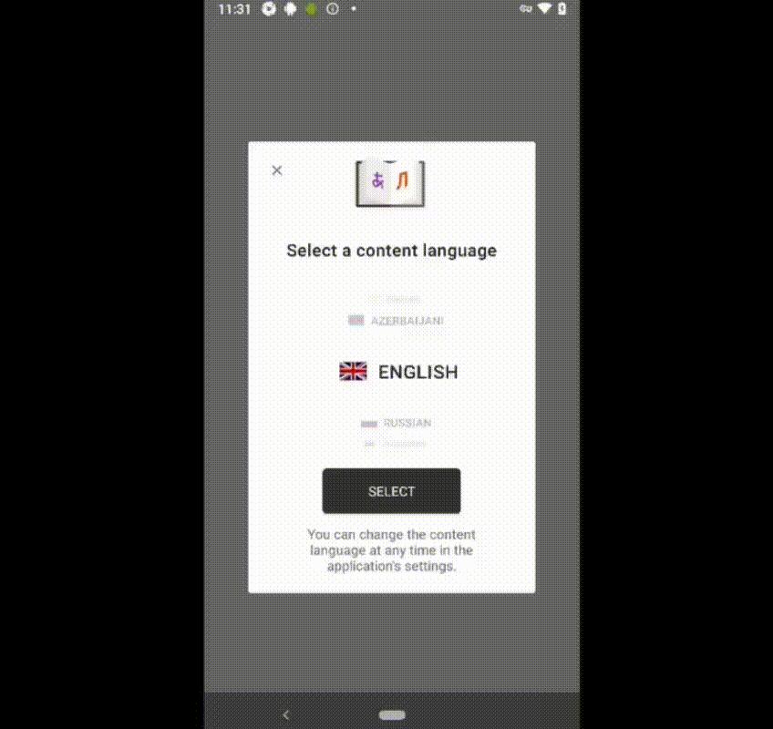

# Test mobile automation project for [Litres](https://www.litres.ru/)

> LitRes is an international company that produces and distributes e-books and digital audiobooks.

# <a name="Description">Description</a>
+ [Technology stack](#Technology)
+ [Tests](#Tests)
+ [Gradle command](#GraleCommand)
+ [Jenkins](#Jenkins)
+ [Test results in Allure](#Allure)
+ [Telegram notification](#Telegram)

# <a name="Technology">Technology stack</a>

[<code></code>](https://www.jetbrains.com/idea/) - development environment

[<code></code>](https://www.java.com/) - the programming language used to write the autotests

[<code></code>](https://github.com/) - a code hosting platform for version control and collaboration

[<code></code>](https://gradle.org/) - a self-assembly system

[<code></code>](https://ru.selenide.org/) - a framework for automated web application testing based on Selenium WebDriver

[<code></code>](https://aerokube.com/selenoid/latest/) - a Selenium testing platform running browsers and mobile platforms in Docker containers

[<code></code>](https://www.browserstack.com/) - is a cloud-based web and mobile testing platform that gives developers the ability to test their websites and mobile apps in browsers on demand

[<code></code>](https://appium.io/) - is an open source test automation framework for use with native, hybrid and mobile web apps

[<code></code>](https://developer.android.com/studio) - integrated development environment to work with the Android platform

[<code></code>](https://junit.org/junit5/)  - a framework for unit testing.

[<code></code>](https://qameta.io/allure-report/) - a flexible, lightweight multi-language test reporting tool

[<code></code>](https://qameta.io/) - Next-gen Software Quality Management Platform for manual and automation testing

[<code></code>](https://www.jenkins.io/) - a system that ensures a process of continuous software integration

[<code></code>](https://www.atlassian.com/ru/software/jira) - a system for task tracking and project management

[<code></code>](https://web.telegram.org/z/) - a cloud-based mobile and desktop messaging app with a focus on security and speed.

[To Description](#Description)

# <a name="tests">Tests</a>
> - Test click on modules;
> - Search test:
  >    - Valid search;
  >    - Invalid search;

[To Description](#Description)

#  <a name="GradleCommand">Gradle Command</a>
**To run the test locally from the terminal, run the command:**
>gradle clean test

[To Description](#Description)

#  <a name="Jenkins">Jenkins</a>
>**1. To start the build, you need to enter the parameters in the settings and then build with the specified parameters:**

[<code></code>](https://jenkins.autotests.cloud/job/litres_mobile_kiriesha/)

>**2. After assembly, you can watch the Allure report:**

[<code></code>](https://jenkins.autotests.cloud/job/litres_mobile_kiriesha/)

[To Description](#Description)

#  <a name="Allure">Test results in Allure</a>
>**Test run (Jenkins):**

[<code></code>](https://jenkins.autotests.cloud/job/Diploma_Kiriesha/2/allure/)

[<code></code>](https://jenkins.autotests.cloud/job/Diploma_Kiriesha/2/allure/#graph)

[To Description](#Description)

#  <a name="BrowserStack">Test results in BrowserStack</a>
>**Test run (BrowserStack):**
>
<code></code>

>**Analysis in the form of graphs:**
> 
<code></code>
<code></code>
> [To Description](#Description)

#  <a name="Telegram">Telegram notification</a>
> **After the build, a report comes in Telegram (using a pre-created bot):**

<code></code>

[To Description](#Description)

**Mobile Test video:**

  

[To Description](#Description)